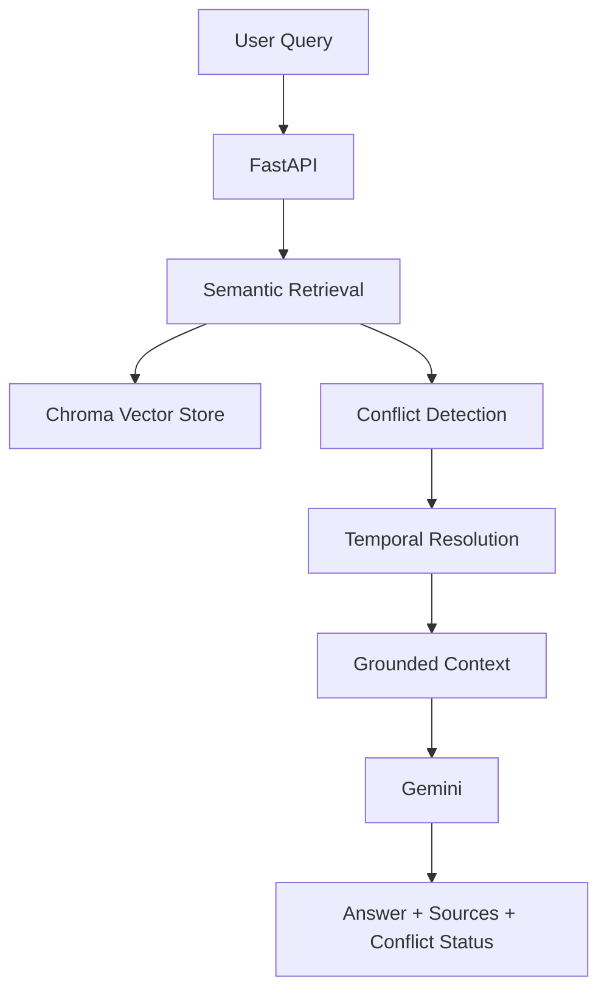

# SafeRAG

### Safety-Aware Retrieval-Augmented Generation for Policy Documents

SafeRAG is a document-grounded RAG system designed to answer questions from hospital and pharmacy policy documents.

Unlike a basic RAG pipeline, SafeRAG includes **metadata-aware retrieval, conflict detection, temporal resolution, and grounded generation** to handle multiple versions of policies more reliably.

---

## Why SafeRAG?

A traditional RAG pipeline can retrieve multiple versions of the same policy and give the LLM conflicting information.

For example:

```text
January 2026 Policy  →  30-minute dispensing target
March 2026 Update    →  20-minute dispensing target
```


## Architecture




End-to-end pipeline:

User Query
    ↓
Metadata-aware Retrieval
    ↓
Conflict Detection
    ↓
Temporal Resolution
    ↓
Grounded Context
    ↓
Gemini Generation
    ↓
Answer + Sources


Key Features
Document Ingestion

PDF documents are processed through:

PDF
 ↓
Loading
 ↓
Metadata Enrichment
 ↓
Chunking
 ↓
Embeddings
 ↓
Chroma


Document metadata includes:

Document ID

Document name

Document date

Page

Department

Document type


Semantic Retrieval

Embeddings:

BAAI/bge-small-en-v1.5


Retrieval uses Maximum Marginal Relevance (MMR):

Top K      = 5
Fetch K    = 20
MMR Lambda = 0.7

Optional metadata filters:

department
document_type
Conflict Detection

Documents are grouped by policy category and checked for multiple versions.
If conflicting versions are retrieved, SafeRAG identifies the conflict before generation.


Temporal Resolution:
Document dates are used to resolve multiple policy versions.


This allows SafeRAG to distinguish between questions such as:

"What is the current pharmacy dispensing target?"
and:
"What was the pharmacy dispensing target in January 2026?"


Grounded Generation:
Gemini is instructed to answer using only the retrieved and resolved context.


The generator is explicitly instructed not to:

Use outside knowledge
Invent facts
Invent dates
Invent policies
Invent sources


If the context is insufficient:
I couldn't find sufficient information in the provided documents.


Tech Stack:

| Component        | Technology             |
| ---------------- | ---------------------- |
| Language         | Python                 |
| API              | FastAPI                |
| LLM              | Gemini 2.5 Flash       |
| Embeddings       | BAAI/bge-small-en-v1.5 |
| Vector Database  | Chroma                 |
| Retrieval        | Semantic Search + MMR  |
| Validation       | Pydantic               |
| Testing          | Pytest                 |
| Containerization | Docker                 |
| Orchestration    | Docker Compose         |


API:

Health Check
GET /health


Example:

{
  "status": "healthy",
  "service": "SafeRAG",
  "environment": "development"
}


Query:

POST /query
Content-Type: application/json


Example request:

{
  "question": "What is the current pharmacy dispensing target?",
  "department": "pharmacy"
}


Example response:

{
  "answer": "The current pharmacy dispensing target is 20 minutes.",
  "sources": [
    {
      "document_id": "PHARM-2026-03",
      "document_name": "04_pharmacy_policy_march_update.pdf",
      "document_date": "2026-03-15",
      "page": 1
    }
  ],
  "conflict_detected": true
}


FastAPI also provides interactive API documentation at:
http://localhost:8000/docs


Project Structure:

SafeRAG/
│
├── app/
│   ├── api/
│   │   └── main.py
│   ├── config/
│   │   └── settings.py
│   ├── ingestion/
│   │   ├── chunker.py
│   │   ├── metadata.py
│   │   └── pipeline.py
│   ├── models/
│   │   └── schemas.py
│   ├── reasoning/
│   │   ├── conflict.py
│   │   ├── generator.py
│   │   ├── rag_pipeline.py
│   │   └── temporal.py
│   └── retrieval/
│       ├── embeddings.py
│       ├── indexer.py
│       ├── retriever.py
│       └── vector_store.py
│
├── data/
│   └── raw/
├── scripts/
├── tests/
├── Dockerfile
├── docker-compose.yml
├── requirements.txt
├── .env.example
└── README.md


Running Locally:
1. Clone

git clone https://github.com/MananPatel52/SafeRAG.git
cd SafeRAG


2. Create virtual environment:

Windows:

python -m venv .venv
.venv\Scripts\Activate.ps1


3. Install dependencies:
pip install -r requirements.txt


4. Configure Gemini:
Create .env:
GEMINI_API_KEY=your_api_key_here
The .env file is excluded from Git.


5. Index documents
python scripts/index_documents.py


6. Start API
uvicorn app.api.main:app --reload --port 8000


API:
http://localhost:8000


Running with Docker:

Build and start:
docker compose up --build


Check the service:
docker compose ps


View logs:
docker compose logs --tail=50 saferag


Stop:
docker compose down


Chroma persistence is configured through:

volumes:
  - ./chroma_data:/app/chroma_data


Testing:

Run the complete test suite:
python -m pytest -v


Current result:
13 passed

Tests cover ingestion, dataset handling, API behavior, and core RAG functionality.


Example:

Historical Query
What was the pharmacy dispensing target in January 2026?

SafeRAG retrieves the January policy rather than automatically returning the latest policy.

Current Query
What is the current pharmacy dispensing target?

SafeRAG identifies the latest applicable policy and generates a grounded answer.
