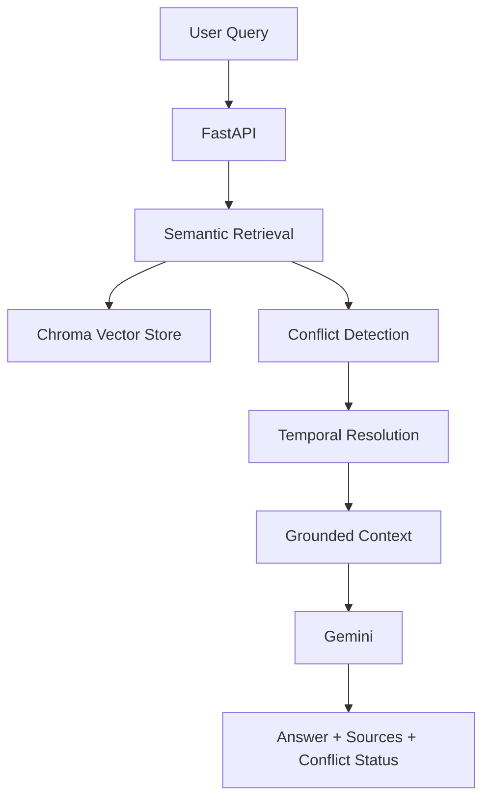

# SafeRAG

### Safety-Aware Retrieval-Augmented Generation for Policy Documents

SafeRAG is a document-grounded RAG system designed to answer questions from hospital and pharmacy policy documents.

Unlike a basic RAG pipeline, SafeRAG includes **metadata-aware retrieval, conflict detection, temporal resolution, and grounded generation** to handle multiple versions of policies more reliably.

---

## Why SafeRAG?

A traditional RAG pipeline can retrieve multiple versions of the same policy and give the LLM conflicting information.

For example:

```text
January 2026 Policy  →  30-minute dispensing target
March 2026 Update    →  20-minute dispensing target
```


## Architecture




------------------------------------------------------------------------------------------------


End-to-end pipeline:

User Query

↓
    
Metadata-aware Retrieval

↓
    
Conflict Detection

↓
    
Temporal Resolution

↓
    
Grounded Context

↓
    
Gemini Generation

↓
    
Answer + Sources


----------------------------------------------------------------------------------------------------------------


Key Features:
Document Ingestion

PDF documents are processed through:

PDF

 ↓
 
Loading

 ↓
 
Metadata Enrichment

 ↓
 
Chunking

 ↓
 
Embeddings

 ↓
 
Chroma


--------------------------------------------------------------------------------------------------------


Document metadata includes:

Document ID

Document name

Document date

Page

Department

Document type


-----------------------------------------------------------------------------------------------------------------------


Semantic Retrieval:


Embeddings: BAAI/bge-small-en-v1.5


Retrieval uses Maximum Marginal Relevance (MMR):

Top K      = 5

Fetch K    = 20

MMR Lambda = 0.7


Optional metadata filters:

department
document_type
Conflict Detection

Documents are grouped by policy category and checked for multiple versions.
If conflicting versions are retrieved, SafeRAG identifies the conflict before generation.


-----------------------------------------------------------------------------------------------------------------------


Temporal Resolution:
Document dates are used to resolve multiple policy versions.


This allows SafeRAG to distinguish between questions such as:

"What is the current pharmacy dispensing target?"
and:
"What was the pharmacy dispensing target in January 2026?"


------------------------------------------------------------------------------------------------------------------------


Grounded Generation:
Gemini is instructed to answer using only the retrieved and resolved context.


The generator is explicitly instructed not to:

Use outside knowledge

Invent facts

Invent dates

Invent policies

Invent sources


If the context is insufficient:
I couldn't find sufficient information in the provided documents.


----------------------------------------------------------------------------------------------------------------------

Tech Stack:

| Component        | Technology             |
| ---------------- | ---------------------- |
| Language         | Python                 |
| API              | FastAPI                |
| LLM              | Gemini 2.5 Flash       |
| Embeddings       | BAAI/bge-small-en-v1.5 |
| Vector Database  | Chroma                 |
| Retrieval        | Semantic Search + MMR  |
| Validation       | Pydantic               |
| Testing          | Pytest                 |
| Containerization | Docker                 |
| Orchestration    | Docker Compose         |


API:

Health Check
GET /health


-----------------------------------------------------------------------------------------


Example:

{
  "status": "healthy",
  "service": "SafeRAG",
  "environment": "development"
}

----------------------------------------------------------------------------------------------

Query:

POST /query
Content-Type: application/json


----------------------------------------------------------------------------------------------


Example request:

{

  "question": "What is the current pharmacy dispensing target?",
  
  "department": "pharmacy"
  
}


----------------------------------------------------------------------------------------------------


Example response:

{

  "answer": "The current pharmacy dispensing target is 20 minutes.",
  
  "sources": [
    {
      "document_id": "PHARM-2026-03",
      "document_name": "04_pharmacy_policy_march_update.pdf",
      "document_date": "2026-03-15",
      "page": 1
    }
  ],
  "conflict_detected": true
}


-------------------------------------------------------------------------------------------------


FastAPI also provides interactive API documentation at:

http://localhost:8000/docs


-------------------------------------------------------------------------------------------------------------


Running Locally:
1. Clone

git clone https://github.com/MananPatel52/SafeRAG.git

cd SafeRAG


-------------------------------------------------------------------------------------------------------------


2. Create virtual environment:

Windows:

python -m venv .venv

.venv\Scripts\Activate.ps1

-------------------------------------------------------------------------------------------------------------

3. Install dependencies:
   
pip install -r requirements.txt

---------------------------------------------------------------------------------------------------------------

4. Configure Gemini:
   
Create .env:

GEMINI_API_KEY=your_api_key_here

The .env file is excluded from Git.

---------------------------------------------------------------------------------------------------------------

5. Index documents:
   
python scripts/index_documents.py

--------------------------------------------------------------------------------------------------------------

6. Start API:
   
uvicorn app.api.main:app --reload --port 8000

--------------------------------------------------------------------------------------------------------------

API:

http://localhost:8000


--------------------------------------------------------------------------------------------------------------


Running with Docker:

Build and start:

docker compose up --build


-------------------------------------------------------------------------------------------------------------------


Check the service:

docker compose ps


-------------------------------------------------------------------------------------------------------------------


View logs:
docker compose logs --tail=50 saferag

--------------------------------------------------------------------------------------------------------------------


Stop:
docker compose down

---------------------------------------------------------------------------------------------------------------------


Chroma persistence is configured through:

volumes:

  - ./chroma_data:/app/chroma_data

--------------------------------------------------------------------------------------------------------------------


Testing:

The project includes both unit and integration tests covering:

- Document ingestion and metadata handling
- Dataset loading
- Semantic and metadata-aware retrieval
- Conflict detection
- Temporal policy resolution
- Grounded Gemini generation
- API validation and end-to-end query behavior
- Prompt-injection security rules

Run the complete test suite:

python -m pytest -v


-------------------------------------------------------------------------------------------------------------------


Current result:
35 tests passed in 23.44 seconds

Test breakdown:
- 27 unit tests
- 8 integration tests

Tests cover ingestion, metadata handling, retrieval, conflict detection, temporal resolution, grounded generation, API behavior, and error handling.


-------------------------------------------------------------------------------------------------------------------


### Evaluation

The project includes a reproducible evaluation harness.

Run:

```bash
python -m evaluation.evaluate
```


SafeRAG includes a lightweight evaluation framework to measure answer quality,
retrieval quality, refusal behavior, citation correctness, and latency.

The evaluation dataset contains 8 representative cases covering:

- Current policy questions
- Historical policy questions
- Repeated queries
- Unsupported questions
- Answer structure

The evaluation reports:

- Faithfulness
- Context precision
- Correct refusal rate
- Citation accuracy
- P50 latency
- P95 latency


Current evaluation result:

| Metric               |      Result |
| -------------------- | ----------: |
| Faithfulness         |        1.00 |
| Context Precision    |       0.375 |
| Correct Refusal Rate |        1.00 |
| Citation Accuracy    |        1.00 |
| P50 Latency          |  9275.44 ms |
| P95 Latency          | 14502.34 ms |


The evaluation uses deterministic, reproducible heuristics. Faithfulness is measured using expected-claim matching rather than an LLM-as-a-judge approach.

Latency measurements represent the real end-to-end pipeline, including retrieval, reasoning, and Gemini generation.


### 3. Evaluation files

```markdown
evaluation/
├── eval_dataset.json
├── evaluate.py
└── evaluation_results.json
```


-----------------------------------------------------------------------------------------------------------------------------------


```markdown
## Observability

SafeRAG implements lightweight structured observability without introducing
a large external monitoring stack.

The pipeline records latency for the major stages of a query:

1. Retrieval
2. Conflict detection
3. Temporal resolution
4. Grounded generation
5. Total query execution

Example events:
```

```text
retrieval_completed
conflict_detection_completed
temporal_resolution_completed
generation_completed
query_completed
```

Each event records relevant metadata such as:

- Execution latency
- Number of documents retrieved
- Number of documents used as context
- Whether a conflict was detected
- Resolved document ID
- Gemini model used
- Prompt token count
- Output token count
- Total token count


```text
Example:

{
  "event": "generation_completed",
  "latency_ms": 8392.36,
  "model": "gemini-3.5-flash",
  "prompt_tokens": 580,
  "output_tokens": 11,
  "total_tokens": 872
}
```


--------------------------------------------------------------------------------------------------------------------------------


Example:

Historical Query

What was the pharmacy dispensing target in January 2026?

SafeRAG retrieves the January policy rather than automatically returning the latest policy.

Current Query

What is the current pharmacy dispensing target?

SafeRAG identifies the latest applicable policy and generates a grounded answer.


--------------------------------------------------------------------------------------------------------------------


## Technology Trade-offs

### ChromaDB vs Traditional SQL Database

ChromaDB was selected because SafeRAG requires semantic vector search and
metadata-aware retrieval. It provides a simple local vector database with
support for similarity search and metadata filtering.

A traditional SQL database would be stronger for transactional workloads,
but would require an additional vector-search layer for semantic retrieval.

**Trade-off:** Simplicity and fast prototyping over transactional/database
features.

### BAAI/bge-small-en-v1.5 vs Larger Embedding Models

The `BAAI/bge-small-en-v1.5` embedding model was selected because it provides
a good balance between semantic retrieval quality, model size, and local
execution cost.

A larger embedding model could potentially improve retrieval quality but
would increase memory usage and inference cost.

**Trade-off:** Retrieval quality vs resource efficiency.

### MMR vs Pure Similarity Search

SafeRAG uses Maximum Marginal Relevance (MMR) retrieval rather than relying
only on the highest similarity scores.

MMR helps reduce redundant chunks and provides more diverse retrieved
context.

**Trade-off:** Slightly more retrieval complexity in exchange for more
diverse context.

### Gemini Flash vs Larger LLMs

Gemini Flash was selected as the generation model because the application
prioritizes low latency and cost efficiency while still requiring reliable
grounded generation.

A larger model could potentially improve reasoning quality but would increase
latency and token cost.

**Trade-off:** Latency and cost vs maximum model capability.

### Custom Observability vs Full Monitoring Stack

Instead of introducing a large observability platform, SafeRAG uses lightweight
structured logging to record pipeline timings and Gemini token usage.

This keeps the project simple while still making the major performance
bottlenecks measurable.

**Trade-off:** Simplicity vs advanced monitoring, dashboards, and distributed
tracing.


-------------------------------------------------------------------------------------------------------------------------------


## Cost & Token Breakdown

SafeRAG records Gemini token usage for each generation request whenever the
API provides usage metadata.

Tracked metrics include:

- Prompt tokens
- Output tokens
- Total tokens
- Generation latency

Example observed generation:

| Metric | Value |
|---|---:|
| Prompt tokens | 580 |
| Output tokens | 11 |
| API-reported total tokens | 872 |
| Generation latency | 8392.36 ms |

The application does not hard-code a cost into the pipeline because API
pricing can change. Cost can be calculated from the recorded token usage
using the active Gemini model's pricing.

For example:

`Estimated Cost = (Input Tokens × Input Price / 1M) +
                  (Output Tokens × Output Price / 1M)`

The current implementation therefore focuses on making token consumption
observable rather than coupling application logic to a specific pricing
table.


------------------------------------------------------------------------------------------------------------------


## Known Limitations

- The evaluation dataset is currently small, with 8 representative cases,
  and is not large enough to establish production-level statistical
  confidence.

- Context precision is currently 0.375, indicating that retrieval can still
  return unnecessary context.

- Query latency can be relatively high because embedding/retrieval and
  remote LLM generation are performed during the request.

- The current observability implementation uses application logs rather than
  a full metrics, tracing, or dashboarding platform.

- Token usage is logged when Gemini exposes usage metadata, so token metrics
  depend on the information returned by the API.

- Temporal resolution currently focuses on month/year references and may not
  cover every possible natural-language date expression.

- The system is designed around the supplied document corpus and does not
  automatically verify information against external sources.

- The evaluation currently measures a small controlled dataset rather than
  continuous production traffic.
